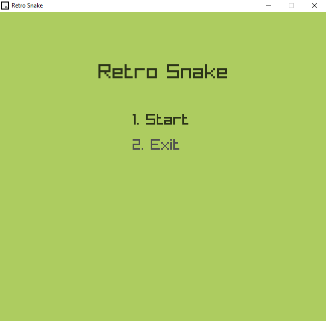
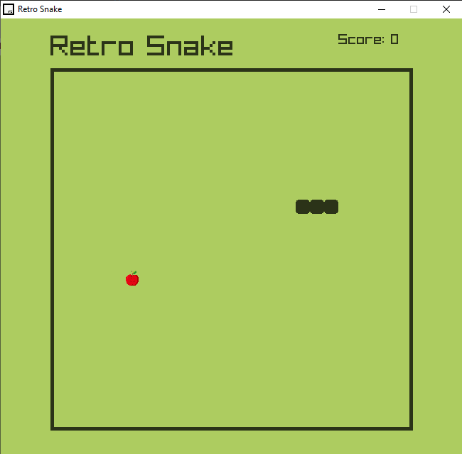
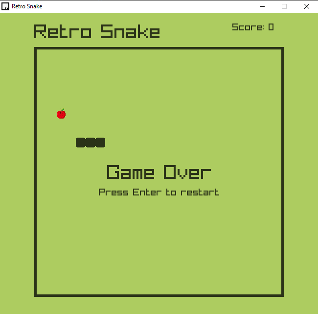

Retro Snake - C++ + Raylib
==========================

📦 About the project:
---------------------
Retro Snake is a small console-based game developed in C++ using the Raylib library. It recreates the classic Snake game with a modern touch, including sounds and smooth visuals—perfect for practicing game development using C++.

🎮 Gameplay:
------------
- The player controls a snake moving across a grid.
- The snake must eat apples to grow and earn points.
- If the snake collides with the wall or itself, the game ends.
- Upon losing, a "Game Over" message is displayed with the option to restart by pressing the ENTER key.

🕹️ Controls:
------------
- Arrow keys ↑ ↓ ← → to move
- ENTER to start the game from the menu
- ENTER to restart after losing

🧠 Programming:
---------------
- The game is structured into three main classes:
  - `Snake`: Handles the snake’s body, direction, and movement.
  - `Food`: Manages apple generation and drawing.
  - `Game`: Controls game flow, collisions, sound effects, and score.
- Raylib is used for:
  - Drawing graphics and rendering text
  - Loading textures and playing sounds
  - Managing the game loop and input
- The project uses structures like `Vector2`, `deque`, and `Rectangle`, along with utility functions such as `Vector2Equals()` and `DrawRectangleRounded()`.

🧩 Resources:
-------------
- Apple texture: `resources/apple.png`
- Eat and collision sounds: `resources/apple.mp3`, `resources/wall.mp3`
- Note: Ensure that resources are copyright-free if you intend to distribute this project.

📸 Screenshots:
---------------

1. Main Menu:
   

2. Gameplay:
   

3. Game Over:
   

💻 Requirements to compile:
---------------------------
- MinGW + Raylib installed
- The following files must be in the same directory:
  - `RetroSnake.exe`
  - `resources/` folder with images and sounds

⚙️ Compilation:
---------------
If you're using VSCode with `tasks.json`, just press **Ctrl + Shift + B**.

Or compile manually using:

```bash
g++ main.cpp -o RetroSnake.exe -IC:/your/path/to/raylib/src -LC:/your/path/to/raylib/src -lraylib -lopengl32 -lgdi32 -lwinmm -mwindows
```

📝 Author:
----------
- Developed by Nilfred Báez
